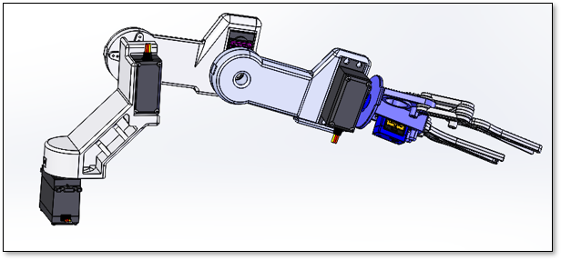
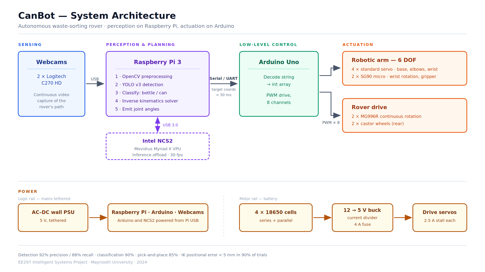

# CanBot — Intelligent Waste Sorter

An autonomous rover that detects bottles and cans with computer vision,
picks them up with a 6-DOF arm, and sorts them into separate bins.
Built against UN SDG 12 (Responsible Consumption and Production).

> Design and results documentation. The vision pipeline source was not
> preserved after the module ended — the kinematics solver, system
> design, and measured results are included here.

## System

The Raspberry Pi handles perception and planning, then sends target
coordinates to the Arduino as a serial string. The Arduino decodes it
and drives eight servos across the arm and rover base. Round-trip
latency stayed under 50 ms.

## Perception

The system originally ran YOLO v2. Testing exposed two problems:
accuracy collapsed under poor lighting and partial occlusion, and the
Darknet implementation was too slow for real-time use on a Pi.

I moved the pipeline to YOLO v3, whose multi-scale feature maps handle
small and partially hidden objects considerably better, collected and
labelled a bottles-and-cans dataset, and fine-tuned the model.
Inference runs on the Intel NCS2, offloading the network from the Pi's
CPU.

| Metric | Result |
|---|---|
| Detection precision | 92% |
| Recall | 88% |
| Classification accuracy | 90% |
| Inference speed | 30 fps (with NCS2) |

Reflective surfaces on cans remained a source of misclassification.

## Manipulation

6-DOF arm designed in SolidWorks and Fusion 360, 3D printed in PLA.
Four standard servos drive the base, elbows, and wrist; two SG90 micro
servos handle wrist rotation and the gripper.

The CAD assembly was exported from Onshape into MATLAB as a
`rigidBodyTree`, then solved with `generalizedInverseKinematics` under
position and aiming constraints — given a target coordinate from the
vision system, the solver returns the joint angles needed to reach it.
Positional error stayed under 5 mm in 90% of trials, with an 85%
overall pick-and-place success rate. Failures were mostly gripper
slippage on lightweight or irregular objects.

See [`kinematics/ik_solver.m`](kinematics/ik_solver.m).

## Rover base

Plywood chassis with a compartmented bin box. Two MG996R continuous-
rotation servos drive the front wheels, castors at the rear. Powered by
4× 18650 cells through a 12→5 V buck converter and a current divider,
fused at 4 A against the servos' 2.5 A stall draw. Trajectory execution
succeeded 95% of the time; runtime around two hours.

## What I'd change

- **The gripper is the bottleneck.** 85% pick success against 90%
  detection accuracy means manipulation, not perception, was the
  limiting subsystem. A compliant or friction-lined gripper would have
  bought more than any further model tuning.
- **Lighting robustness was addressed too late.** Contrast
  normalisation in preprocessing helped, but training on a dataset
  captured under varied lighting from the start would have been the
  cheaper fix.
- **Navigation is open-loop.** Following a predefined trajectory with
  no odometry means slippage accumulates. Encoders or visual odometry
  are the obvious next step.
- **No material properties in CAD.** The imported model has zero
  inertial terms, so the solver is kinematic only — fine for pose
  solving, useless for torque analysis. Assigning materials would have
  made the arm's load capacity something we could calculate rather than
  discover.

## Stack

Python · OpenCV · YOLO v3 · TensorFlow · Raspberry Pi OS · Intel NCS2 ·
Arduino C++ · MATLAB (Robotics System Toolbox) · SolidWorks ·
Fusion 360 · Onshape

## Files

- `kinematics/ik_solver.m` — MATLAB IK solver (Onshape import → GIK)
- `docs/technical-report.pdf` — full system design, methodology, results
- `docs/process-report.pdf` — team process and my contribution in detail
- `docs/presentation.pdf` — project presentation
- `images/` — arm CAD render, system architecture

---

EE297 Intelligent Systems Project, Maynooth University, Year 2
Semester 1 (Dec 2024). Team of 8 — my contribution: computer vision
(YOLO v3 migration, dataset collection and labelling, training,
Raspberry Pi deployment) and rover base development. Full team credited
in the reports.
